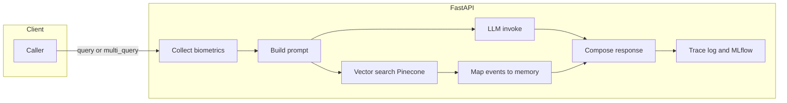
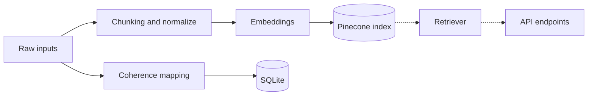

# Signal Memory Engine v1

A conversational Retrieval-Augmented Generation (RAG) microservice powered by FastAPI, OpenAI, Pinecone, and LangChain. Features multi-agent handoff logic, biometric signal context, event-to-memory mapping, and a Streamlit UI for visualization.

---

## Features

* **Single-Agent RAG**: Query a memory index via the `/query` endpoint, using a RetrievalQA chain with OpenAI’s GPT models and Pinecone vector store.
* **Multi-Agent Fan-Out**: Route queries to three specialized agents—Axis™ Relationship Architect, Oria™ HR Oracle, and M™ Shadow Sentinel—via the `/multi_query` endpoint. Each agent returns an answer, top memory chunks, a stability flag, and a suggestion.
* **Agents & Scoring Endpoints** *(new)*:
  * `GET /agents` — lists configured agents and whether each is enabled.
  * `POST /score` — returns trust score + flag without an LLM call (fast smoke/health signal).
* **Health Check** *(new)*: `GET /health` verifies core env and a simple write/read operation.
* **Biometric Context**: Simulate HRV, temperature, and blink rate readings and inject them into queries to enrich system context.
* **Event-to-Memory Mapping**: Normalize raw RAG hits into structured events (ID, content, score, timestamp, metadata) via Coherence Commons.
* **Agent-to-Agent Handoff**: Automatically escalate high-severity flags by notifying a human-in-the-loop endpoint.
* **Signal Logging**: Persist signals and drift events to SQLite with `/signal` and query user drift history with `/drift/{user_id}`.
* **Memory Log**: Tail recent trace logs via `/memory_log`.
* **Search API**: Query Pinecone directly with `/memory/search`.
* **Streamlit UI**: Interactive frontend (`streamlit_app.py`) that shows answers, memory chunks, flags, suggestions, and drift visualizations per agent.
* **Unified Logging** *(new)*: Structured logging via `utils/logging_setup.py` with `LOG_LEVEL` support.
* **Offline Test Stub** *(new)*: Pinecone is fully stubbed in tests/CI to avoid network calls and 401s.

---

## 📘 Documentation

* **Flow PDFs**
  * [Query Endpoint Flow (PDF)](./docs/query_endpoint_flow.pdf)
  * [Ingestion, Coherence, and Storage Flow (PDF)](./docs/ingestion_coherence_storage_flow.pdf)
* **Architecture**
  * `docs/adr/ADR-0001-v2-backbone.md` — v2 backbone decisions (deps centralization, Pinecone stub, multi-index strategy, logging, CI).

---

## Table of Contents

1. [Prerequisites](#prerequisites)  
2. [Installation](#installation)  
3. [Configuration](#configuration)  
4. [Running the API](#running-the-api)  
5. [Streamlit UI](#streamlit-ui)  
6. [Running with Docker](#running-with-docker)  
7. [Running with core.py](#running-with-corepy)  
8. [Endpoints](#endpoints)  
9. [Testing & CI](#testing--ci)  
10. [Makefile Shortcuts](#makefile-shortcuts)  
11. [Pipeline Diagram](#pipeline-diagram)  
12. [Project Structure](#project-structure)

---

## Prerequisites

* Python 3.10+
* Pinecone account (API key & environment) — **only for non-test runs**
* OpenAI account (API key) — **only for non-test runs**

---

## Installation

> This repo’s CI uses both **pip** and **Conda**. Dependencies are managed via `requirements.in`/`requirements-lock.txt` and `environment.yml`.

### With Pip

```bash
# Create & activate virtual environment
python3.10 -m venv venv
source venv/bin/activate  # or .\venv\Scripts\activate on Windows

# Install dependencies
pip install -r requirements.txt
```

### With Conda

```bash
# Create env from environment.yml and activate it
conda env create -f environment.yml

# If your environment.yml names the env (e.g., "sme310"), activate it:
conda activate sme310
```

---

## Configuration

Create a `.env` file in the project root (or copy `.env-example`):


```ini
OPENAI_API_KEY=your-openai-key
PINECONE_API_KEY=your-pinecone-key
PINECONE_ENV=us-west1-gcp

# Single-index fallback used by some code paths
PINECONE_INDEX=axis-memory

# Multi-index list used in tests/agents (comma-separated)
PINECONE_INDEXES=axis-memory,sentinel-memory,oria-memory,test-index,signal-engine

# Expected embedding dimension
PINECONE_DIMENSION=384

# Logging
LOG_LEVEL=INFO

# Test toggles (stubbed runs avoid network)
SME_TEST_MODE=0
RUN_API_SMOKE=0

# Optional services
MLFLOW_TRACKING_URI=http://mlflow:5000
BACKEND_URL=http://localhost:8000
```

> Tip: In tests/CI, the Pinecone client is stubbed automatically when SME_TEST_MODE=1 or PINECONE_API_KEY=dummy is set.

---

## Running the API

```bash
# Start FastAPI server
uvicorn api.main:app

# Start FastAPI server with live reload (only track key directories)
uvicorn api.main:app --reload \
  --reload-dir api --reload-dir agents --reload-dir coherence \
  --reload-dir utils --reload-dir storage --reload-dir scripts
```

The API will run at `http://127.0.0.1:8000`.

### Using Makefile
```bash
# The Makefile lives in signal_memory_engine_v1/
cd signal_memory_engine_v1
make dev # will run with live reload
```

### Logging Format
`utils/logging_setup.py` configures structured, single-line logs:
```python
%(asctime)s level=%(levelname)s name=%(name)s msg="%(message)s"
```

> Override with LOG_LEVEL=DEBUG|INFO|WARNING|ERROR.

---

## Streamlit UI

Run the Streamlit app:

```bash
streamlit run streamlit_app.py
```

The sidebar allows you to configure:

* **Backend URL** (e.g. `http://localhost:8000`)
* **Mode**: Single-Agent vs. Multi-Agent
* **Number of chunks (k)**

Submit a query to see answers, chunks, flags, suggestions, and drift visualizations.

---

## Running with Docker

```bash
# Start & Build Docker Containers
docker compose up --build
```

> Ensure your `.env` is present in the repo root (see [Configuration](#configuration)).

---

## Running with `core.py`

```bash
python core.py
```

> `core.py` builds a **RetrievalQA** chain and **Pinecone** vectorstore **without** the FastAPI server—useful for quick experiments.

---

## Endpoints

### Single-Agent RAG

**POST** `/query`

**Request Body**:

```json
{
  "query": "Your question here",
  "k": 3
}
```

**Response**:

```json
{
  "answer": "...",
  "chunks": [
    {"content": "...", "score": 0.72},
    ...
  ],
  "flag": "stable",    
  "suggestion": "No action needed."
}
```

### Multi-Agent Fan-Out

**POST** `/multi_query`

**Request Body**:

```json
{
  "query": "Your question here",
  "k": 3
}
```

**Response**:

```json
{
  "agents": {
    "Axis™ Relationship Architect": { /* AgentResponse */ },
    "Oria™ HR Oracle":           { /* AgentResponse */ },
    "M™ Shadow Sentinel":         { /* AgentResponse */ }
  }
}
```

Each `AgentResponse` matches the single-agent response schema.

### Memory Log

**GET** `/memory_log`

**Query Parameters**:

* `limit` (int, default = 20) — number of recent records to return.

**Response**:

```json
[
  {
    "timestamp": "2025-09-11T22:39:54.123Z",
    "request_id": "abc123",
    "agent": "single-agent",
    "query": "What is emotional recursion?",
    "flag": "stable",
    "trust_score": 0.72
  }
]
```

### Signal Logging

**POST** `/signal`

**Request Body**:

```json
{
  "user_id": "u123",
  "user_query": "Hello world",
  "signal_type": "relational",
  "drift_score": 0.3,
  "emotional_tone": 0.5,
  "payload": {"foo": "bar"},
  "relationship_context": "manager",
  "diagnostic_notes": "sample note"
}
```

**Response**:

```json
{
  "id": 1,
  "timestamp": "2025-09-11T22:39:54.123Z",
  "user_id": "u123",
  "user_query": "Hello world",
  "signal_type": "relational",
  "drift_score": 0.3,
  "emotional_tone": 0.5,
  "agent_id": "Selah",
  "payload": {"foo": "bar"},
  "relationship_context": "manager",
  "diagnostic_notes": "sample note",
  "escalate_flag": 0
}
```

### Memory Search

**GET** `/memory/search`

**Query Parameters**:

* `q` (string, required) — natural language query.
* `top_k` (int, default = 3) — number of results to return.

**Response**:

```json
[
  {
    "id": "doc123",
    "score": 0.82,
    "text": "Sample content",
    "agent": "Axis™ Relationship Architect",
    "tags": ["tag1", "tag2"],
    "metadata": {"source": "pinecone"}
  }
]
```

### Agents

**GET** `/agents`

Lists agents known to the service and whether each is **enabled**, based on the `ENABLED_AGENTS` environment variable (comma-separated).

**Response**:

```json
{
  "agents": [
    {"role": "Axis", "enabled": true},
    {"role": "Oria", "enabled": true},
    {"role": "Sentinel", "enabled": false}
  ]
}
```

### Trust Score

**POST** `/score`

Accepts the same body as `/query` but returns only the derived trust score and flag, for lightweight health/sanity checks.

**Request Body**:

```json
{
  "query": "Your question here",
  "k": 3
}
```

**Response**:

```json
{
  "trust_score": 0.72,
  "flag": "drifting"
}
```

---

## Testing & CI

### Local dev commands

From `signal_memory_engine_v1/`:

```bash
# run unit tests (quiet)
make test            # -> pytest -q

# type-check
make type            # -> mypy .

# lint
make lint            # -> ruff check .

# format (if you added a target)
make black           # -> black .

# run API with live reload
make dev

# build & run with Docker Compose
make build
```

### Pre-commit hooks:
```bash
pre-commit install
pre-commit run -a
```

### CI pipeline (GitHub Actions)

Workflow file: .github/workflows/ci.yml (in the repo root).

Jobs:
* pip (matrix): Ubuntu + macOS × Python 3.10/3.11/3.12
	* Installs deps from requirements-lock.txt (or requirements.in fallback)
	* ruff → mypy → pytest with coverage (uses root .coveragerc)
* conda: Ubuntu + Python 3.10 using environment.yml
	* pytest with coverage and --cov-fail-under=80
* docker: builds backend image and runs the smoke test inside the container in offline mode:
	* RUN_API_SMOKE=0 / SME_TEST_MODE=1
	* PINECONE_INDEXES set to include all expected test indexes

---

## Pipeline Diagram

### High-level request path (API)



### Ingestion → Coherence → Storage



---

## Project Structure

```
Signal_memory_engine/                         # repo root
├── .github/
│   └── workflows/
│       └── ci.yml                            # CI pipeline
├── .coveragerc                               # shared coverage config (CI & local)
└── signal_memory_engine_v1/                  # app + tests (working dir for dev)
    ├── __init__.py                           # package marker
    ├── setup.py                              # (semantic packaging for runtime deps)
    ├── Makefile                              # dev shortcuts (dev, lint, type, test, build, black)
    ├── pyproject.toml                        # ruff/mypy/black config
    ├── pytest.ini                            # pytest defaults
    ├── requirements.in                       # minimal top-level deps
    ├── requirements-lock.txt                 # fully pinned lock (if present)
    ├── environment.yml                       # Conda env (parity with requirements.in)
    ├── .pre-commit-config.yaml               # hooks: ruff, black, mypy
    ├── .env.example                          # sample env (copy to .env)
    ├── sitecustomize.py                      # auto Pinecone stub installer
    ├── starter.sh                            # convenience launcher (loads .env, uvicorn + Streamlit)
    ├── mlruns/                               # MLflow tracking dir (created at runtime)
    │   └── (experiment runs)
    ├── api/
    │   ├── __init__.py
    │   ├── main.py                           # FastAPI app (calls setup_logging(); includes routers)
    │   ├── models.py                         # Pydantic schemas
    │   ├── deps.py                           # shared singletons (QA chain, vector store, agents)
    │   └── routes/
    │       ├── __init__.py
    │       ├── query.py                      # POST /query
    │       ├── multi.py                      # POST /multi_query
    │       ├── memory.py                     # GET /memory_log
    │       ├── search.py                     # GET /memory/search
    │       ├── signal.py                     # POST /signal, GET /drift/{user_id}
    │       ├── agents.py                     # GET /agents
    │       └── health.py                     # GET /health
    ├── agents/
    │   ├── __init__.py                       # ensures Pinecone indexes in live mode
    │   ├── axis_agent.py
    │   ├── oria_agent.py
    │   ├── m_agent.py
    │   └── router_stub.py
    ├── coherence/
    │   └── commons.py
    ├── ingestion/
    │   ├── __init__.py
    │   └── batch_loader.py
    ├── processing/
    │   ├── __init__.py
    │   ├── normalizer.py
    │   └── stream_processor.py
    ├── sensors/
    │   └── biometric.py                      # simulated biometrics
    ├── cli/
    │   ├── __init__.py
    │   └── healthcheck.py                    # optional CLI utilities
    ├── scripts/
    │   ├── __init__.py
    │   ├── smoke_test.py                     # smoke runner (used by CI docker job & tests)
    │   ├── probe_openai.py                   # quick OpenAI connectivity check
    │   ├── langchain_retrieval.py
    │   ├── ingest_memories.py
    │   ├── seed_data.py
    │   └── drift_monitor.py
    ├── storage/
    │   └── sqlite_store.py
    ├── utils/
    │   ├── __init__.py
    │   ├── logging_setup.py                  # structured logging; honors LOG_LEVEL
    │   ├── llm.py
    │   ├── tracing.py
    │   └── pinecone_stub.py                  # centralized Pinecone test stub (used by tests)
    ├── vector_store/
    │   ├── __init__.py
    │   ├── embeddings.py
    │   └── pinecone_index.py
    ├── streamlit_app.py
    ├── core.py                               # legacy: build chain without API
    ├── tests/
    │   ├── conftest.py                       # installs Pinecone stub; test env defaults
    │   ├── test_smoke.py                     # runs scripts/smoke_test.run_smoke()
    │   ├── test_router_stub.py
    │   ├── test_storage_sqlite_store.py
    │   ├── test_coherence_commons.py
    │   ├── test_ingestion_batch_loader.py
    │   └── test_ingestion_ingest_memory.py
    └── data/
        └── (gitignored runtime files, e.g., signal.db)
```

---

Contributions, issues, and PRs are welcome!